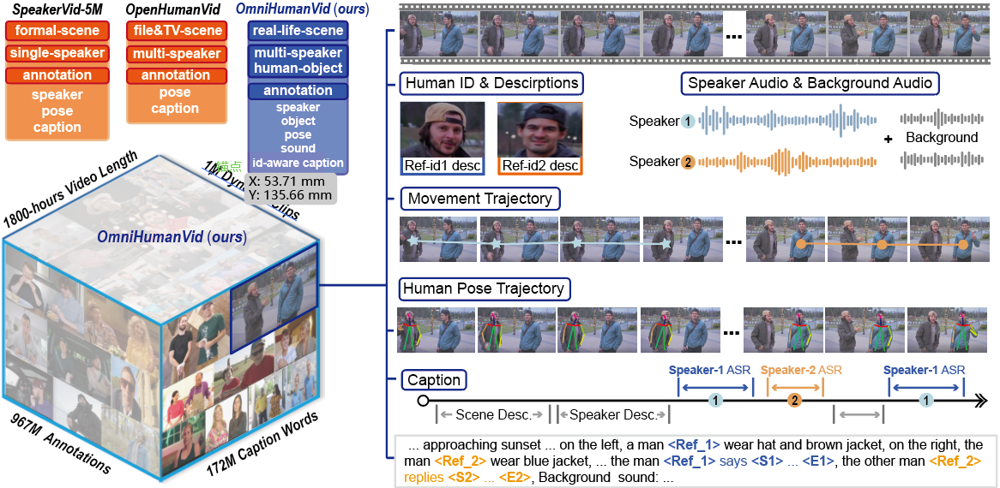
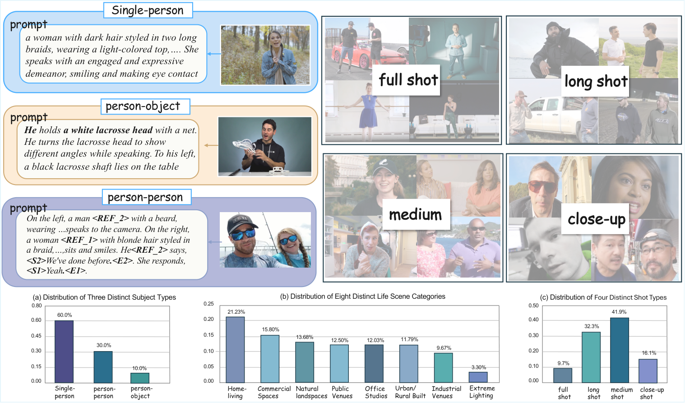

<div align="center">

# OmniHuman
### A Large-scale Dataset and Benchmark for Human-Centric Video Generation

<p>
  <a href="https://julia-cherry.github.io/OmniHuman/">
    
  </a>
  <a href="https://arxiv.org/abs/2604.18326">
    
  </a>
  <a href="https://huggingface.co/datasets/julia527/omnihuman">
    
  </a>
  <a href="https://huggingface.co/julia527/omnihuman_benchmark">
    
  </a>
</p>

**Official repository for OmniHuman.**

</div>

<p align="center">
  
</p>

---

## ✨ Overview

**OmniHuman** is a large-scale, multi-scene audio-visual dataset for fine-grained human-centric video modeling.

- **1M videos** totaling **1,800 hours**
- **80K distinct identities**
- Rich **human-human** and **human-object** interactions
- Hierarchical annotations covering **global scenes**, **relational interactions**, and **individual attributes**
- **OHBench**, a human-aligned benchmark for comprehensive evaluation of human-centric audio-video generation

> 🌐 For interactive video demonstrations and qualitative results, please visit our **[Project Page](https://julia-cherry.github.io/OmniHuman/)**.

---

## 📥 Dataset

| Resource | Link |
|---|---|
| **OmniHuman Dataset** | [🤗 Hugging Face](https://huggingface.co/datasets/julia527/omnihuman) |

For download and usage, please follow the instructions on the Hugging Face dataset page.

---

## 📈 OHBench

OHBench provides a comprehensive evaluation of human-centric audio-video generation across global quality, relational interactions, and individual fidelity.

<p align="center">
  
</p>

### Benchmark assets

| Resource | Link |
|---|---|
| **Models + `ohbench_dir.tar`** | [🤗 Hugging Face](https://huggingface.co/julia527/omnihuman_benchmark) |

After downloading, make sure the following two assets are available under `ohbench/`:

- `ohbench/models/` — model checkpoints, mainly `.pt` / `.onnx`, plus required model directories
- `ohbench/ohbench_dir/` — extracted benchmark assets referenced by `ohbench/configs/paths.env`

Example:

```bash
cd ohbench

# Download ONLY the models folder into ./models/
huggingface-cli download julia527/omnihuman_benchmark \
  --repo-type model \
  --local-dir . \
  --include "models/**"

# Download benchmark assets
huggingface-cli download julia527/omnihuman_benchmark \
  --repo-type model \
  --local-dir . \
  --include "ohbench_dir.tar"

tar -xf ohbench_dir.tar
```

---

## 🛠️ Installation

Clone this repository:

```bash
git clone https://github.com/julia-cherry/OmniHuman.git
cd OmniHuman
```

Create a clean environment, install FFmpeg, then install PyTorch and runtime dependencies:

```bash
conda create -n ohbench python=3.10 -y
conda activate ohbench
conda install -y -c conda-forge ffmpeg

# Install the CUDA build that matches your environment.
# Example: CUDA 12.1
pip install -U "torch==2.5.1" "torchvision==0.20.1" "torchaudio==2.5.1" \
  --index-url https://download.pytorch.org/whl/cu121

cd ohbench
pip install -U pip
pip install -r requirements.txt
```

---

## 🧾 OHBench Metrics

| Category | Metrics |
|---|---|
| **Video Quality** | `IQ`, `DD`, `IC`, `IC*`, `V-A`, `T-A` |
| **Audio Quality** | `FD`, `KL`, `AbS`, `WER`, `LSE-C` |
| **Speech Quality** | `SQ` |
| **Person-Person** | `IN`, `ES`, `LR` |

<details>
<summary><b>Metric modules and details</b></summary>

### `video_quality`

- Metrics: `IQ(imaging_quality)`, `DD(dynamic_degree)`, `IC(id_csim_single)`, `IC*(id_csim_double)`, `V-A(imagebind-av)`, `T-A(clap_score)`
- Modules:
  - `evaluators/video_quality`
  - `evaluators/identity_consistency`
  - `evaluators/av_semantic_alignment`

### `audio_quality`

- Metrics: `FD`, `KL`, `AbS`, `WER`, `LSE-C`
- Module: `evaluators/audio_quality`

### `speech_quality`

- Metric: `SQ` (DNSMOS overall MOS)
- Module: `evaluators/speech_quality`

### `person_person`

- Metrics: `IN`, `ES`, `LR`
- LLM-based; double-person videos only
- Module: `evaluators/person-person`

</details>

---

## 🚀 Running OHBench

### 1. Configure benchmark asset paths

Edit:

```text
ohbench/configs/paths.env
```

Make sure the following paths are correctly configured:

| Variable | Description |
|---|---|
| `CUSTOM_IMAGE_FOLDER` | Reference images for `video_quality` |
| `GT_SINGLE_DIR` | Single-person GT faces for identity consistency |
| `GT_DOUBLE_DIR` | Two-person GT images for identity consistency |
| `AUDIO_QUALITY_BENCHMARK_DIR` | Audio-quality benchmark assets |
| `AV_INPUT_CSV` | CSV for audio-video semantic alignment |
| `EVAL_CUDA_DEVICES` | GPU IDs, e.g. `0` or `0,1,2,3` |
| `EVAL_TORCH_DEVICE` | Usually `cuda:0` |

### 2. Run all metrics

From the repository root:

```bash
cd ohbench

bash scripts/run_all.sh \
  --input_dir /path/to/generated_mp4s \
  --output_dir /path/to/results \
  --name my_model
```

The output `${name}_all.json` aggregates metrics under:

- `video_quality`
- `audio_quality`
- `speech_quality`
- `person_person`

The merged audio-video cache is always:

```text
<input_dir>_audio_video_merged
```

> `--api_key` is required when running `person_person`.

### 3. Run a single category

```bash
bash scripts/run_all.sh --input_dir /path/to/videos --output_dir /path/to/out --only video_quality

bash scripts/run_all.sh --input_dir /path/to/videos --output_dir /path/to/out --only audio_quality

bash scripts/run_all.sh --input_dir /path/to/videos --output_dir /path/to/out --only speech_quality

bash scripts/run_all.sh --input_dir /path/to/videos --output_dir /path/to/out \
  --only person_person --api_key "$BLTCY_API_KEY"
```

---

## 🌐 Project Page

Our project page contains interactive demonstrations of:

- OmniHuman dataset samples
- OHBench qualitative cases
- Identity, interaction, emotion, object, and attribute evaluation examples
- Before/after fine-tuning comparisons

👉 **[Visit the OmniHuman Project Page](https://julia-cherry.github.io/OmniHuman/)**

---

## 📝 Citation

If you find OmniHuman useful for your research, please consider citing our work:

```bibtex
@article{omnihuman2026,
  title   = {OmniHuman: A Large-scale Dataset and Benchmark for Human-Centric Video Generation},
  year    = {2026}
}
```

> Please replace the BibTeX entry above with the official citation from the paper once finalized.

---

<div align="center">

### ⭐ If you find this project useful, a star is greatly appreciated.

[Project Page](https://julia-cherry.github.io/OmniHuman/) ·
[Paper](https://arxiv.org/abs/2604.18326) ·
[Dataset](https://huggingface.co/datasets/julia527/omnihuman) ·
[OHBench](https://huggingface.co/julia527/omnihuman_benchmark)

</div>
